# Benchmark analysis and plotting (`run-analysis.py`)

This document explains how `run-analysis.py` turns the Cooja log (`COOJA.testlog`) into the printed summary and the `plots.pdf` report.

## 1. Pipeline overview

```mermaid
flowchart LR
    A[node.c firmware<br/>+ TSCH / RPL / Link-stats / Energest logs] --> B[Cooja simulation<br/>cooja-sims/*.csc]
    B --> C[coojalogger.js<br/>writes '&lt;time&gt; &lt;id&gt; &lt;msg&gt;']
    C --> D[COOJA.testlog]
    D --> E[run-analysis.py<br/>parse line by line]
    E --> F[NodeStats per node]
    F --> G[calc&#40;&#41; final metrics]
    G --> H[Terminal summary]
    G --> I[plots.pdf, 6 pages]
```



| Step | File | Role |
|------|------|------|
| 1 | [node.c](node.c) | Application: non-root nodes send a UDP packet with an increasing `seqnum` to the RPL root; the root logs every received `seqnum`. |
| 2 | [project-conf.h](project-conf.h) | Enables the logs the analysis needs and sets traffic parameters. |
| 3 | [Makefile](Makefile) | TSCH + RPL Classic, plus `simple-energest` for energy logs. |
| 4 | [run-cooja.py](run-cooja.py) | Runs Cooja headless on `cooja-sims/1-cooja.csc`, output goes to `COOJA.testlog`. |
| 5 | [coojalogger.js](coojalogger.js) | Cooja script that prints every mote log line as `<time_us> <node_id> <message>`. |
| 6 | [run-analysis.py](run-analysis.py) | Parses the log, computes metrics, prints a summary, writes `plots.pdf`. |

Usage:

```bash
python3 run-cooja.py                 # produces COOJA.testlog
python3 run-analysis.py              # reads COOJA.testlog, writes plots.pdf
python3 run-analysis.py other.log    # analyze another log
```

## 2. Simulation and application parameters

From [project-conf.h](project-conf.h) and [node.c](node.c):

| Parameter | Value | Meaning |
|-----------|-------|---------|
| `APP_WARM_UP_PERIOD_SEC` | 120 | Nodes wait at least 120 s (plus a random offset up to one interval) before the first packet. |
| `APP_SEND_INTERVAL_SEC` | 10 | One packet per node every 10 s. |
| `COORDINATOR_ID` | 1 | Node 1 is RPL root and TSCH coordinator. The script excludes it from the plots (`COORDINATOR_ID = 1`). |
| `LINK_STATS_CONF_PACKET_COUNTERS` | 1 | Makes `link-stats.c` print per-neighbor packet counters periodically. |
| `LOG_CONF_LEVEL_RPL` / `LOG_CONF_LEVEL_MAC` | INFO | Needed for RPL parent and TSCH association/time-source lines. |
| `TSCH_LOG_CONF_PER_SLOT` | 0 | No per-slot logging, keeps the log small. |
| Energest period | 60 s | Printed by `simple-energest` (`Period summary #N (60 seconds)`). |
| Simulation length | 3600 s | `TIMEOUT(3600000)` in `coojalogger.js`. The log ends with `Script timed out.` and `TEST OK`. |

A packet is generated only when `NETSTACK_ROUTING.node_is_reachable()` is true, so `seqnum` counts packets that were actually handed to the network.

## 3. Log format

Each line in `COOJA.testlog` is:

```
<time in microseconds> <node id> <original mote log line>
```

Example: `900073000 8 [INFO: Link Stats] num packets: tx=253 ack=157 ...`

After `line.split()`, `fields[0]` is the time and `fields[1]` is the node ID. Lines that fail to parse these two values (for example `Starting COOJA logger`, `TEST OK`) are skipped by the `try/except`.

Timestamps are converted from microseconds to milliseconds (`// 1000`), and to seconds (`/ 1000`) when stored as join times.

### Testbed mode

`main()` checks whether the file contains `Starting COOJA logger`. If not, the file is treated as a testbed log (`is_testbed = True`), whose lines are `<unix_time>;<device>;<message>`:

- time is made relative to the first line,
- the node ID is taken from the device string (`fields[1][3:]`),
- `node_id_to_device_id` maps the application `node_id=` (from `app generate packet`) to the testbed device so root-side `from=` addresses can be attributed to the right device.

For Cooja logs none of this applies.

## 4. Log lines consumed

The parser walks the file once and updates a `NodeStats` object per node ID. Each rule below corresponds to one `if` in `analyze_results()`.

| Log line (substring matched) | Source | Fields used | Effect on `NodeStats` |
|------------------------------|--------|-------------|-----------------------|
| `association done` | TSCH | time | Sets `tsch_join_time_sec` (first time only), `is_tsch_joined = True`. |
| `leaving the network` | TSCH | none | `is_tsch_joined = False`, `energest_joined = False`. |
| `update time source: A -> B` | TSCH queue | `B` | `tsch_time_source = B` (link-layer address of the current parent; `None` if NULL). |
| `rpl_set_preferred_parent <ip> used to be ...` | RPL | `fields[6]` | `rpl_parent_changes += 1`, `rpl_parent = <ip>`, sets `rpl_join_time_sec` once. |
| ` parent switch: A -> B` | RPL | `B` | Same as above (alternative message format). |
| `app generate packet seqnum=N node_id=X` | App | `N` | `max_seqnum_sent = max(max_seqnum_sent, N)`. |
| `app receive packet seqnum=N from=<ipv6>` | App (root) | `N`, sender | Adds `N` to the **sender's** `seqnums_received_on_root` set. |
| `num packets: tx=.. ack=.. rx=.. queue_drops=.. to=<lladdr>` | Link stats | all counters | Accumulated only if `to` equals the node's current `tsch_time_source`. |
| `INFO: Energest` lines | simple-energest | tick counts | Accumulate CPU / LPM / Radio Tx / Radio Rx / total time. |

Details worth knowing:

- **Sender attribution at the root.** The root prints the sender as `fd00::206:6:6:6`. `addr_to_id()` takes the last `:`-separated group (`6`) and parses it as hex, giving node ID 6. This relies on the simulation's address scheme (node N has IID ending in `N`).
- **Link-stats counters are per print interval.** `link-stats.c` prints `cnt_current` and then zeroes it, so summing every print gives the total since boot. Only lines whose `to=` address is the node's current time source (its parent) are counted, so traffic to other neighbors is ignored.
- **Energest lines.** Each 60 s period prints `Period summary`, `Total time`, `CPU`, `LPM`, `Deep LPM`, `Radio Tx`, `Radio Rx`, `Radio total`. The script:
  - reads the period length from the `Period` line (`fields[9][1:]`, e.g. `(60` becomes `60`),
  - adds `Total time` to `energest_total`, and sets `energest_ticks_per_second = total / period`,
  - adds the tick count of the other lines to the matching counter,
  - adds to `*_joined` counters only if the node was TSCH-joined (`energest_joined`). That flag is refreshed at each `Radio Rx` line from `is_tsch_joined`.

## 5. Per-node metrics (`NodeStats.calc()`)

After parsing, `calc()` is called for every node except the coordinator.

### 5.1 Validity

A node is `is_valid` only if it has all of: a TSCH join, an RPL parent, and at least one generated packet. Otherwise a message is printed (`never associated TSCH`, `never joined RPL DAG`, `never sent any data packets`) and `calc()` returns zeros for the link and end-to-end totals.
With `PLOT_ALL_NODES = True` invalid nodes are still plotted; set it to `False` to plot only valid nodes.

### 5.2 Packet Delivery Ratio (PDR), end to end

```
PDR(node) = 100 * |seqnums_received_on_root| / max_seqnum_sent
```

- Numerator: distinct sequence numbers from that node seen by the root (duplicates count once because a `set` is used).
- Denominator: highest `seqnum` the node generated, which is the number of packets it sent.
- Packets still in flight when the simulation ends are counted as lost, so PDR slightly below 100% is expected.

### 5.3 Packet Acknowledgement Ratio (PAR), link layer

```
PAR(node) = 100 * parent_packets_ack / parent_packets_tx
```

Counts are the sums of `tx` and `ack` from `num packets` lines toward the node's current time source. It measures link-layer transmissions toward the parent that were acknowledged, so retransmissions lower it.

### 5.4 RPL parent switches

`rpl_parent_changes` counts `rpl_set_preferred_parent` and `parent switch` lines. The first one is the initial parent selection, so a node that never changes parent shows 1.

### 5.5 Radio duty cycle

```
RDC        = 100 * (radio_tx + radio_rx) / energest_total
RDC_joined = 100 * (radio_tx + radio_rx_joined) / energest_total_joined
```

The first uses the whole run. The second uses only periods during which the node was joined to the TSCH network.

### 5.6 Charge consumption

Each Energest tick count is converted to seconds (`ticks / energest_ticks_per_second`) and multiplied by a current (mA):

```
charge = I_tx   * t_tx
       + I_rx   * t_rx
       + I_cpu  * t_cpu_on
       + I_sleep      * t_cpu_sleep
       + I_deepsleep  * t_cpu_deep_sleep      (result in mA*s = mC)
```

| Constant | Value (mA) | Source |
|----------|-----------|--------|
| `CC2650_RADIO_TX_CURRENT_MA` | 9.100 | CC2650 datasheet, 5 dBm |
| `CC2650_RADIO_RX_CURRENT_MA` | 5.900 | CC2650 datasheet |
| `CC2650_RADIO_CPU_ON_CURRENT` | 0.061 x 48 MHz = 2.928 | CC2650 datasheet |
| `CC2650_RADIO_CPU_SLEEP_CURRENT` | 1.335 | empirical |
| `CC2650_RADIO_CPU_DEEP_SLEEP_CURRENT` | 0.010 | empirical |

If a node has no Energest data, a warning is printed and `rdc` and `charge` are set to 0.

## 6. Network-level summary (terminal output)

After all nodes are computed, `analyze_results()` sums raw counts over the non-coordinator nodes that pass the `is_valid or PLOT_ALL_NODES` filter:

```
Link-layer PAR = 100 * sum(ack) / sum(tx)
End-to-end PDR = 100 * sum(received at root) / sum(sent)
```

It also returns the total number of `queue_drops`. `main()` prints:

```
Link-layer PAR=64.62 (0 packets queue dropped) End-to-end PDR=99.96
```

These are **weighted** totals (nodes with more traffic count more). The average line drawn on each plot is the **unweighted** mean of the per-node bars, so the two values can differ slightly (for example PAR 64.62 in the terminal against 63.64 on the plot).

## 7. Plotting (`plot()` and `plots.pdf`)

`main()` opens one `PdfPages('plots.pdf')` and calls `plot()` six times. Each call adds one page.

| Page | Metric key | Y label |
|------|-----------|---------|
| 1 | `pdr` | Packet Delivery Ratio, % |
| 2 | `par` | Packet Acknowledgement Ratio, % |
| 3 | `rpl_switches` | RPL parent switches |
| 4 | `duty_cycle` | Radio Duty Cycle, % |
| 5 | `duty_cycle_joined` | Joined Radio Duty Cycle, % |
| 6 | `charge` | Charge consumption, mC |

For each page:

1. `results` is a list of dicts, one per node: `{id, pdr, par, rpl_switches, duty_cycle, duty_cycle_joined, charge}`. The page's data is `[r[metric] for r in results]`.
2. One orange bar per node, with the node ID on the x axis.
3. The value is printed above each bar (`bar_label`, one decimal).
4. `avg = sum(data) / len(data)` is drawn as a red dashed line, shown in the legend and under the x label as `Average: ...`.
5. The y axis:
   - PDR: from `min(80, lowest value)` to 108, so differences near 100% stay visible and labels fit above.
   - Others: from 0 to 1.2 x the largest value, leaving room for the labels.
6. The figure width scales with the number of nodes (`0.45 in` per node, at least 6 in).

## 8. Known caveats in the current parser

These were checked against the lines in `COOJA.testlog` and affect only the **charge** metric (and `rdc_joined`), not PDR, PAR, RPL switches or `duty_cycle`.

1. **`CPU` and `LPM` tick values are mis-parsed.** The tick value is read as `fields[8][:-1]`. That works for the two-word lines (`Radio Tx`, `Radio Rx`, `Deep LPM`), where `fields[8]` is `9319552/`. For the one-word lines `CPU` and `LPM` the tokens shift by one, so `fields[8]` is the period total (`60000000`) and the slice gives `6000000`. The CPU time is therefore 1/10 of the real value, and `LPM` is read as 6000000 instead of 0.
2. **LPM and Deep LPM are assigned to swapped variables.** `"Deep LPM"` is added to `energest_cpu_sleep` and `"LPM"` to `energest_cpu_deep_sleep`, so the sleep and deep-sleep currents are applied to the wrong states.
3. **`rdc_joined` mixes scopes.** `energest_radio_tx` covers all periods, while `energest_radio_rx_joined` and `energest_total_joined` cover only joined periods.
4. **Address-to-ID mapping.** `addr_to_id()` assumes the last IPv6 group equals the node ID in hex.

Fixing 1 and 2 would raise the reported charge values, since the CPU-on term (2.928 mA) is currently under-counted.
