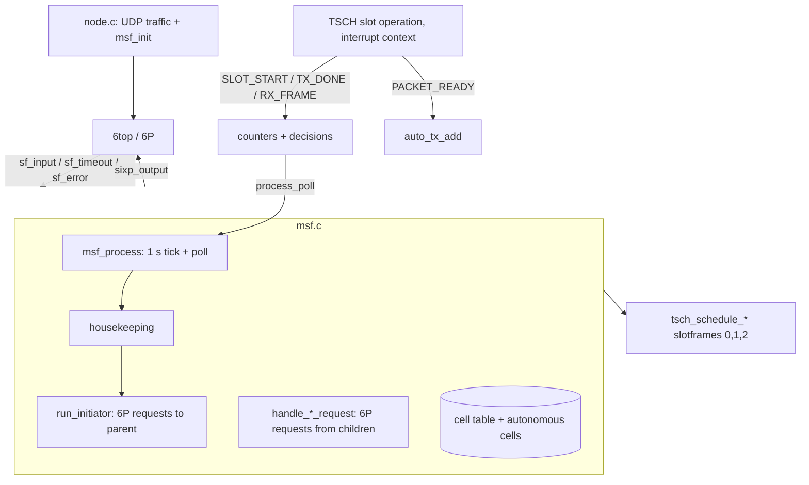
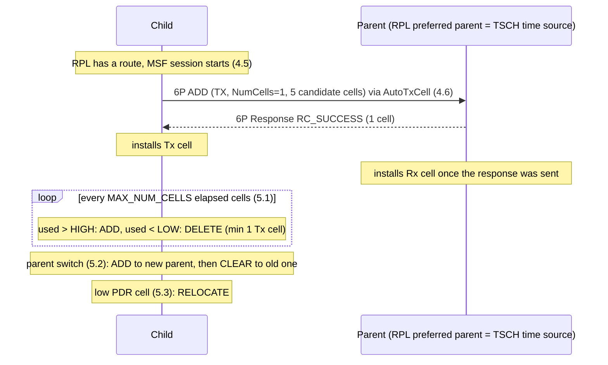

# 6TiSCH Minimal Scheduling Function (MSF) for Contiki-NG

Reference implementation of [RFC 9033](https://www.rfc-editor.org/rfc/rfc9033) (MSF) on top of
Contiki-NG's 6top/6P stack ([RFC 8480](https://www.rfc-editor.org/rfc/rfc8480)). The scheduler is a
separate module (`msf.c`, `msf.h`); the benchmark application (`node.c`) only calls `msf_init()`.

6P API usage follows `examples/6tisch/6p-packet/test-sf.c`.

## 1. Files

| File | Role |
|------|------|
| `msf.h` | Public API, RFC constants (Table 2) with `MSF_CONF_*` overrides |
| `msf.c` | The scheduling function |
| `node.c` | Benchmark application, unchanged except `#include "msf.h"` and `msf_init()` |
| `Makefile` | Adds `PROJECT_SOURCEFILES += msf.c` and the sixtop module |
| `project-conf.h` | Enables 6top, slotframe length 101, TSCH callbacks |
| `os/net/mac/tsch/tsch.h`, `tsch-slot-operation.c` | Three optional hooks added to TSCH (see section 6) |

## 2. Architecture



Two execution contexts:

- **Interrupt context (TSCH callbacks):** only increment counters and set a `decision[]` flag, then `process_poll()`. No logging, no schedule changes.
- **Process context (`msf_process`):** all schedule changes and all 6P traffic.

## 3. Schedule layout

| Slotframe | Handle | Content | RFC |
|-----------|--------|---------|-----|
| Minimal | 0 | Shared Tx/Rx cell at (0,0), created by TSCH | 2 |
| Autonomous | 1 | AutoRxCell (always), AutoTxCell (on demand) | 3 |
| Negotiated | 2 | Cells negotiated through 6P | 5 |

All three have the same length, `TSCH_SCHEDULE_DEFAULT_LENGTH` = 101 (RECOMMENDED, Section 2).

- **AutoRxCell:** `TX=0, RX=1, SHARED=0`, slot = `1 + SAX(EUI64, L-1)`, channel offset = `SAX(EUI64, NUM_CH_OFFSET)`.
- **AutoTxCell:** `TX=1, RX=0, SHARED=1` towards the destination of a unicast frame, slot/channel from the hash of the destination. Added when a frame is queued and there is no negotiated Tx cell to that destination, removed when the queue is empty or a negotiated Tx cell exists.
- **Negotiated cell:** dedicated (not shared) Tx or Rx cell with one peer.

TSCH rebuilds its schedule on every (re)association, so slotframes 1 and 2 are created from `schedule_setup()` once `tsch_is_associated` is set and recreated if found missing.

## 4. Behaviour overview



### 4.1 Adapting to traffic (Section 5.1)

Per direction (Tx, Rx) the node keeps `NumCellsElapsed` and `NumCellsUsed` (1 byte each, Table 3).

- `NumCellsElapsed` +1 for every slot whose link is a negotiated cell to the parent. For downstream traffic the AutoRxCell counts too while no negotiated Rx cell exists.
- `NumCellsUsed` +1 when a frame is sent to the parent on a negotiated Tx cell (acknowledged or not), or a valid frame from the parent is received on a negotiated Rx cell / the AutoRxCell.
- When `NumCellsElapsed >= MAX_NUM_CELLS`: `used > LIM_NUMCELLSUSED_HIGH` gives ADD, `used < LIM_NUMCELLSUSED_LOW` gives DELETE; both counters restart.

### 4.2 Switching parent (Section 5.2)

`update_parent()` detects a new time source, `begin_switch()` records how many Tx/Rx cells the old parent had, `run_initiator()` adds the same number with the new parent, and `check_switch_done()` then queues a CLEAR for the old parent. A timeout (5 min) finishes a stuck switch.

### 4.3 Schedule collisions (Section 5.3)

Each negotiated Tx cell keeps `NumTx`/`NumTxAck`; both are halved when `NumTx` reaches `MAX_NUMTX`. Every `HOUSEKEEPINGCOLLISION_PERIOD`, cells with significant statistics are compared; a cell whose PDR is more than `RELOCATE_PDRTHRES` below the best is moved with 6P RELOCATE.

### 4.4 6P error handling (Section 12, Table 1)

| Return code | Action in this code |
|-------------|---------------------|
| `RC_SUCCESS`, `RC_EOL` | apply the response |
| `RC_ERR`, `RC_RESET`, `RC_ERR_VERSION`, `RC_ERR_SFID` | quarantine (`quarantine_peer`) |
| `RC_ERR_SEQNUM`, `RC_ERR_CELLLIST` | clear (`queue_clear`) and wait |
| `RC_ERR_BUSY`, `RC_ERR_LOCKED` | waitretry: random 30-60 s hold |
| 6P transaction timeout / request not delivered | waitretry |
| Schedule inconsistency (`sf_error`) | clear (Section 13) |

## 5. Function reference (`msf.c`)

### 5.1 Encoding and hashing

| Function | Purpose | RFC |
|----------|---------|-----|
| `put_cell` / `get_cell` | Write/read a 4-byte 6P cell (slot, channel, little endian) | RFC 8480 |
| `sax_hash` | SAX hash of an EUI-64 (h0=0, l_bit=0, r_bit=1) | App. A |
| `auto_slot_of` | `1 + hash(addr, length - 1)` | 3 |
| `auto_channel_of` | `hash(addr, NUM_CH_OFFSET)` | 3 |

### 5.2 Schedule and candidate-cell helpers

| Function | Purpose | RFC |
|----------|---------|-----|
| `get_slotframe` | Slotframe by handle | - |
| `slot_is_free` | Slot is not 0 and unused in slotframes 1 and 2 | 8 |
| `cell_id_in_list` | Is a (slot, channel) in a list | - |
| `pick_candidate_cells` | Random free cells, distinct slotOffsets, random channels | 8 |
| `traffic_reset` | Zero the 5.1 counters and decisions (critical section) | 5.1 |

### 5.3 Negotiated cell table

| Function | Purpose |
|----------|---------|
| `cell_install` | Add a link to slotframe 2 and a table entry (initiator or responder role) |
| `cell_remove` | Remove link and entry |
| `cells_remove_all` | Remove all cells with a peer (used by CLEAR) |
| `cell_lookup` | Find by peer, direction, slot, channel |
| `cell_lookup_by_position` | Find by slot/channel only (used from interrupts) |
| `cells_count` | Number of cells with a peer, direction and role |
| `cells_free` | Free table entries |
| `refresh_counts` | Update `parent_rx_cells` (decides whether the AutoRxCell counts) |

### 5.4 Autonomous cells (Section 3)

| Function | Purpose |
|----------|---------|
| `auto_rx_install` | Install the AutoRxCell |
| `auto_tx_add` | Install an AutoTxCell towards a destination; merges with or replaces the AutoRxCell on a slot collision |
| `auto_tx_remove` | Remove it and restore the AutoRxCell if it was replaced |
| `auto_tx_find` | Entry for a destination |
| `auto_tx_cleanup` | Remove AutoTxCells with no frame to send or with a negotiated Tx cell |

### 5.5 TSCH callbacks (interrupt context)

| Function | Hook | Purpose |
|----------|------|---------|
| `msf_callback_slot_start` | `TSCH_CALLBACK_SLOT_START` | `NumCellsElapsed` |
| `msf_callback_tx_done` | `TSCH_CALLBACK_TX_DONE` | `NumCellsUsed` (Tx), per-cell `NumTx`/`NumTxAck` |
| `msf_callback_rx_frame` | `TSCH_CALLBACK_RX_FRAME` | `NumCellsUsed` (Rx), cell activity time |
| `msf_callback_packet_ready` | `TSCH_CALLBACK_PACKET_READY` | AutoTxCell on demand |
| `count_elapsed` | internal | Evaluates the 5.1 rule when `MAX_NUM_CELLS` is reached, polls the process |
| `count_used` | internal | Saturating `NumCellsUsed` increment |

### 5.6 6P requests we send (initiator)

| Function | Purpose | RFC |
|----------|---------|-----|
| `send_add` | ADD, NumCells=1, 5 candidate cells | 4.6, 5.1, 8 |
| `send_delete` | DELETE one cell | 5.1 |
| `send_relocate` | RELOCATE one Tx cell with a candidate list | 5.3 |
| `send_clear` | CLEAR (metadata only) | 5.2, 12 |
| `build_request_header` | Metadata (unused, 11), CellOptions, NumCells | 11 |
| `set_candidates` | Fill CellList or CandCellList | 8 |
| `txn_send` | `sixp_output()` plus bookkeeping of the single open transaction | - |
| `request_sent_callback` | Request not delivered: waitretry | 12 |

### 5.7 6P responses we receive

| Function | Purpose |
|----------|---------|
| `response_input` | Dispatch by return code (Table 1) |
| `complete_add` | Install the granted cell (must be one we offered and still free) |
| `complete_delete` | Remove the deleted cells |
| `complete_relocate` | Replace the old cell by the new one; an empty list keeps the old cell |

### 5.8 6P requests we answer (responder)

| Function | Purpose |
|----------|---------|
| `handle_add_request` | Grant up to NumCells usable cells (empty list if none); TX from requester becomes our Rx cell |
| `handle_delete_request` | Delete matching responder cells, `RC_ERR_CELLLIST` if none |
| `handle_relocate_request` | Move an Rx cell to the first usable candidate; Rx relocation is refused |
| `handle_clear_request` | Remove all negotiated cells with the requester, never autonomous cells |
| `respond_error` | Response with an error code and empty body |
| `offered_cell_is_usable` | Section 8 checks on a cell offered by a peer |
| `pending_alloc` / `pending_apply` | State kept until the response was transmitted |
| `response_sent_callback` | Applies the schedule change on a successful transmission |
| `send_response` | `sixp_output()` of an `RC_SUCCESS` response |

### 5.9 Quarantine and CLEAR queue

| Function | Purpose |
|----------|---------|
| `queue_clear` | Remove local cells with a peer and queue a CLEAR |
| `quarantine_peer` / `quarantine_add` | Clear and block 6P with the peer for `QUARANTINE_DURATION` |
| `is_quarantined` | Is a peer in quarantine (expires entries) |
| `run_clear_queue` | Send queued CLEARs (best effort) |

### 5.10 Scheduling function driver (`msf_driver`)

| Function | Purpose | RFC |
|----------|---------|-----|
| `sf_input` | Entry point for incoming 6P packets | 6 |
| `sf_timeout` | Transaction timeout, waitretry | 9, 12 |
| `sf_error` | Schedule inconsistency leads to clear | 13 |
| `sf_init` | Reset state and start `msf_process` | - |
| `msf_init` | `sixtop_add_sf(&msf_driver)`; SFID is 0 | 7 |

### 5.11 Housekeeping (process context)

| Function | Purpose | RFC |
|----------|---------|-----|
| `msf_process` | Runs `housekeeping()` every second and when polled | - |
| `housekeeping` | Order: schedule, autonomous cells, parent, switch, cleanup, decisions, collisions, initiator | - |
| `state_reset` | Clear all state and slotframes 1/2 | - |
| `schedule_setup` | Create slotframes 1/2 and the AutoRxCell | 2, 3 |
| `update_parent` | Parent = TSCH time source (follows the RPL preferred parent), only once RPL is reachable | 4.5 |
| `start_session` | Begin an MSF session with a parent | 1 |
| `begin_switch` / `check_switch_done` | Parent switch | 5.2 |
| `collect_decisions` | Take ADD/DELETE decisions from the interrupt-side flags | 5.1 |
| `check_collisions` | PDR comparison, marks a cell for RELOCATE | 5.3 |
| `run_initiator` | Starts at most one 6P transaction, in priority order (below) | 4.6, 5 |
| `cell_to_delete` | Chooses the most recently added cell of a direction | 5.1 |
| `cleanup_idle_cells` | Removes responder cells idle for `MSF_CELL_IDLE_TIMEOUT` | 5.1 |
| `reap_pending_responses` | Frees stale response state | - |
| `hold_wait_retry` / `hold_short` / `hold_is_active` | Back-off before the next request | 12 |

`run_initiator` priority: queued CLEAR, first Tx cell or cells missing during a switch, Rx cells during a switch, RELOCATE, Tx ADD/DELETE, Rx ADD/DELETE.

## 6. TSCH hooks added to the core

All are compiled out unless defined in `project-conf.h`.

| Hook | Where | Why |
|------|-------|-----|
| `TSCH_CALLBACK_SLOT_START(link)` | `tsch_slot_operation()`, again after a fall-back to the backup Rx link | `NumCellsElapsed` |
| `TSCH_CALLBACK_TX_DONE(link, nbr, status)` | after `tsch_queue_packet_sent()` | `NumCellsUsed`, `NumTx`, `NumTxAck` |
| `TSCH_CALLBACK_RX_FRAME(link, src)` | after a valid frame for us is accepted | `NumCellsUsed` (Rx) |
| `TSCH_CALLBACK_PACKET_READY` | existing hook | AutoTxCell on demand |

## 7. Configuration

Defined in `msf.h`; override with `MSF_CONF_<NAME>` in `project-conf.h`.

| Constant | Default | RFC |
|----------|---------|-----|
| `SLOTFRAME_LENGTH` | 101 (`TSCH_SCHEDULE_CONF_DEFAULT_LENGTH`) | Table 2 |
| `NUM_CH_OFFSET` | 16 | Table 2 |
| `MAX_NUM_CELLS` | 100 | Table 2 |
| `LIM_NUMCELLSUSED_HIGH` / `LOW` | 75 / 25 | Table 2 |
| `MAX_NUMTX` | 256 | Table 2 |
| `HOUSEKEEPINGCOLLISION_PERIOD` | 60 s | Table 2 |
| `RELOCATE_PDRTHRES` | 50 % | Table 2 |
| `QUARANTINE_DURATION` | 5 min | Table 2 |
| `WAIT_DURATION_MIN` / `MAX` | 30 s / 60 s | Table 2 |
| `6P_TIMEOUT` | `((2^MAXBE)-1) * MAXRETRIES * SLOTFRAME_LENGTH` slots | 9 |
| `NUM_CANDIDATE_CELLS` | 5 | 4.6, 8 |
| `MAX_NEGOTIATED_CELLS` | 24 | implementation |
| `MAX_CELLS_PER_PARENT` | 8 per direction | implementation |
| `MAX_AUTO_TX_CELLS` | 4 | implementation |
| `CELL_IDLE_TIMEOUT` | 30 min | 5.1 cleanup |

Also set in the example `project-conf.h`: `TSCH_CONF_WITH_SIXTOP 1`, `TSCH_SCHEDULE_CONF_MAX_LINKS 64`, `SIXTOP_CONF_MAX_TRANSACTIONS 4`.

## 8. Build and run

```bash
cd examples/msf/msf-benchmarks
make TARGET=cooja node.cooja        # compile check
python3 run-cooja.py                # headless Cooja run, writes COOJA.testlog
grep "MSF" COOJA.testlog            # MSF events
python3 run-analysis.py             # needs matplotlib
```

Log lines (module `MSF`, level INFO): `schedule ready`, `MSF session with parent`, `send 6P ADD/DELETE/RELOCATE/CLEAR`, `6P ADD from`, `negotiated Tx/Rx cell added/removed`, `parent switch`, `collision suspected`, `quarantine`.

To exercise the traffic adaptation with the default 10 s traffic interval, temporarily add `#define MSF_CONF_LIM_NUMCELLSUSED_HIGH 5` to `project-conf.h`.

## 9. Deviations and limitations

- **No CoJP join (Section 4.3-4.4):** Contiki-NG has no CoJP; the node starts MSF once RPL has a route.
- **One link per timeslot:** Contiki-NG's TSCH allows a single link per timeslot in a slotframe. An AutoTxCell hashing onto the AutoRxCell slot merges with it (same channel) or replaces it until removed.
- **Quarantine:** clears cells and blocks 6P with the neighbor; it does not evict it from neighbor/routing tables.
- **Counters:** `NumTx` and `NumTxAck` are 16 bits because `MAX_NUMTX` is 256 (Table 3 recommends 1 byte).
- **6P cell grants:** MSF asks for one cell per request; a responder grants at most one cell per request.
- **Rx relocation:** not supported, as stated in Section 5.3.
- **Parent selection:** the selected parent is the TSCH time source, which `tsch-rpl` keeps equal to the RPL preferred parent.
- **6LoWPAN log errors:** `uncompression: unknown dispatch` appears after 6P frames; this is existing 6top behaviour.
